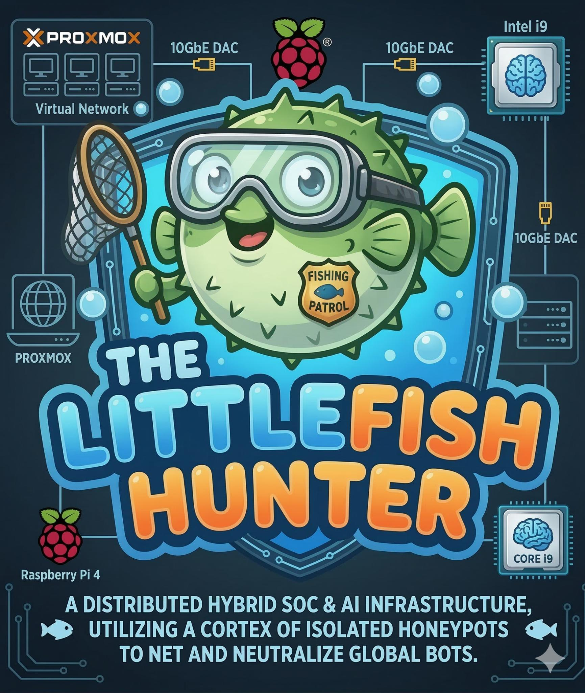
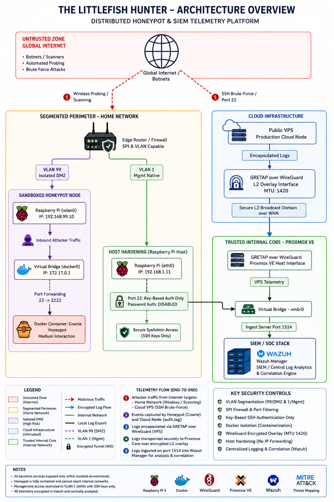

<p align="center">
  
</p>

<br>
<br>

# The Littlefish Hunter – AI-Powered Honeypot & Threat Detection Node

An automated Cyber Threat Intelligence (CTI) and forensic analysis platform deployed within a residential hybrid infrastructure (**rpilab**). This project demonstrates initial access interception, cross-infrastructure network telemetry correlation, and active post-exploitation attribution of global automated threat campaigns.

<br>
<br>
<br>

## 🛠️ Infrastructure Architecture & Flow

<p align="center">
  
</p>

<br>
<br>
<br>

---

<br>

## 🚀 Project Phases & Evolution

<br>

* 🔹 **Phase 1: Hybrid Core Infrastructure** – Deployment of the central cross-platform SIEM/XDR management stack. Implemented a centralized Wazuh Manager on Proxmox VE, establishing secure cloud connectivity to a remote public VPS via an encrypted WireGuard tunnel with custom `iptables` DNAT and MASQUERADE routing rules. Enforced deep telemetry collection across LAN endpoints using Windows Sysmon event channels and resource-optimized IoT logging.

<br>

* 🔹 **Phase 2: The Sentinel (Active Defense & LAN Validation)** – Deployment of the dedicated Raspberry Pi 4 network sensor node. [cite_start]Containerized the medium-interaction Cowrie honeypot using Docker and enforced zero-trust network perimeter isolation using an Alta Labs Route10 router[cite: 654, 656, 687]. [cite_start]Segmented the infrastructure into an isolated Attack Zone (VLAN 99) for wlan0 and a secure Management LAN (VLAN 1) for eth0 log shipping. [cite_start]Conducted pre-deployment offline manual testing and penetration simulation inside the LAN using a local Ubuntu attacking node (`nmap` / `hydra`) to validate the end-to-end telemetry pipeline and verify custom Wazuh decoding rules before shifting the sensor online[cite: 658, 659, 663, 691, 694, 695].

<br>

* [cite_start]🔹 **Phase 3: NAT Boundary De-anonymization & SOC Hardening** – Resolved a critical architectural "Visibility Gap" inherent in Reverse-Proxy/DNAT topologies, where internal backend systems perceive all forwarded malicious traffic as originating from the local tunnel gateway peer (`10.10.10.x`)[cite: 570, 572]. [cite_start]Implemented live edge telemetry logging via custom `iptables` tracking rules in the `PREROUTING` chain on the cloud gateway node[cite: 585, 587]. [cite_start]Configured the local Wazuh daemon to capture these raw packet headers before network translation (`/var/log/kern.log`), automatically re-establishing original source IP visibility and enabling native GeoIP threat enrichment[cite: 568, 585, 588, 603, 604].

<br>

* [cite_start]🔹 **Phase 4: Stateful Threat Intelligence & Correlation (Current)** – Developed composite correlation rules (`Rule 100305`, Level 12 Critical Alert) within the Wazuh Manager to cross-reference concurrent multi-node telemetry streams[cite: 610, 614, 621, 625]. [cite_start]The system statefully links a perimeter firewall connection hit on the public gateway with an immediate application-level authentication failure on a hidden local endpoint[cite: 608, 610, 613, 625]. This enables the isolation, profiling, and micro-level forensic analysis of coordinated global botnet campaigns attempting to leverage distributed attack frameworks.

<br>
<br>
<br>

---

<br>

## 📋 Project Overview & CTI Metrics

<br>

* 🛡️ **SIEM Platform:** Wazuh Manager (Debian) hosting a heterogeneous fleet of 9 active endpoints across 5 operating systems.
* [cite_start]🪵 **Telemetry Source:** Cowrie Honeypot (Hardened Docker Image, port mapping 22 -> 2222) + Public VPS Auth Engine[cite: 687].
* 🌐 **Attack Surface Volume:** Captured **937 unique attacking IP addresses** on the residential honeypot and **30,576 authentication failures** on the public cloud node within a single 24-hour window.
* 🎯 **Cross-Infra Correlation:** Confirmed an active, coordinated botnet campaign utilizing 4 sequential IPs from a single /29 routed block (**87.251.64.144–149**) attacking both independent environments concurrently (1,244 total correlated hits).
* 🏴‍☠️ **Adversary Attribution:** Threat actor group utilizing Polish ASN space (WHOIS: Isaev Igor Maratovich) operating rented VPS scanning nodes alongside active IoT worms targeting default hardware firmware credentials (`345gs5662d34`).

<br>
<br>
<br>

---

<br>

## 🔬 Project Documentation & Technical Reports

This laboratory setup generated high-fidelity telemetry that was analyzed and documented across successive execution phases. You can access the complete technical PDF reports directly within this repository:

<br>

### 📄 Phase 1: Core SOC Infrastructure Deployment
* **Description:** Engineering the cross-platform SIEM/XDR environment. Covers local virtualization routing stability (Proxmox VE), WireGuard L3 forwarding over NAT via advanced `iptables` rules, and deep Sysmon ingest configuration for Windows Server 2025 endpoints.
<br>

* 👉 [Download SOC Infrastructure Phase 1 Report (PDF)](./SOC_wazuh_phase1.pdf)

<br>
<br>

### 📄 Phase 2: Active Defense & SIEM Integration
* [cite_start]**Description:** Technical documentation focusing on host hardening, hardware-level VLAN 99 network segmentation using Alta Labs infrastructure, and configuring local dockerized sandboxes[cite: 656, 657]. [cite_start]Includes full documentation of offline manual penetration simulation (using a local Ubuntu attacking node) and validation of the container pipeline to verify live alerts generation in the Wazuh dashboard prior to public exposure[cite: 658, 659, 663, 694, 695].
<br>

* 👉 [Download Honeypot Sensor Lab Phase 2 Report (PDF)](./The_Little_Fish_Hunter.pdf)

<br>
<br>

### 📄 Phase 2 Extension: Honeypot Simulation & Detection Validation
* [cite_start]**Description:** Advanced attack scenario validation log capturing full multi-stage adversary tactics[cite: 644]. [cite_start]Documents structural alert responses for non-intrusive service scans (`nmap -sV -Pn`), high-frequency automated password cracking suites (`hydra`), and tracks post-compromise terminal command injection chains[cite: 660, 667, 689, 691, 724, 725, 751].
<br>

* 👉 [Download Honeypot Validation Blueprint (PDF)](<./The Little Fish Hunter – Attack Simulation & Detection Validation (Phase 2).pdf>)

<br>
<br>

### 📄 Phase 3: Hybrid Infrastructure De-anonymization Report
* [cite_start]**Description:** Advanced engineering blueprint detailing the technical elimination of proxy-induced identity masking[cite: 564, 569]. [cite_start]Maps out the setup of native edge-level logging rule chains (`SOC_ACCESS`), Wazuh data log parsers, custom XML correlation parameters, and live GeoIP analysis[cite: 568, 585, 587, 588, 604, 621, 628, 632].
<br>

* 👉 [Download De-anonymization Architecture Report (PDF)](./De-anonymizing_Attacks.pdf)

<br>
<br>

### 📄 Phase 4: Comprehensive Threat Intelligence (Final Report)
* **Description:** The final core research paper cross-referencing multi-node global telemetry to isolate coordinated botnet campaigns. Profiles real-world adversary behavior, analyzes credential-stuffing distributions, and establishes definitive attribution metrics.
<br>

* 👉 [Download Threat Intelligence Phase 3 Report (PDF)](./TheLittleFishHunter_Phase3_FINAL_RAPORT.pdf)

<br>
<br>

### 📄 Incident Analysis Study: Distributed Attack Infrastructure
* **Description:** A macro-level investigation focused on the wide-scale triangulation of automated global campaigns, profiling carrier netblocks, geographic attacker distribution, and multi-vector credential stuffing blasts.
<br>

* 👉 [Download Campaign Intelligence Report (PDF)](./SOC_Threat_Intelligence_Report_Botnet_Campaign.pdf)

<br>
<br>

### 📄 Forensic Deep Dive: Threat Host Attribution
* **Description:** A micro-level forensic examination isolating a single high-frequency attacking node. Outlines the active technical CLI workflow executed on the host system to extract IoC artifacts from a **56.9 MB** raw `cowrie.json` telemetric stream.
<br>

* 👉 [Download Deep-Dive Forensic Report (PDF)](./CTI_Threat_Report_Kinsing_Botnet.pdf)

<br>
<br>
<br>

---

<br>

## 💻 Forensic Log Extraction Playbook (Summary)

To bypass image bin constraints within the active container, the following forensic execution layout was utilized to isolate 29 unique malicious SSH public keys:

<br>

```bash
# 1. Audit container state
docker ps

# 2. Extract active telemetry database out of the container
docker cp cowrie:/home/cowrie/cowrie/log/cowrie.json ./cowrie_local.json

# 3. Parse and de-duplicate raw ssh-rsa strings using regex
grep -o "ssh-rsa [A-Za-z0-9+/]*=\?" cowrie_local.json | sort -u > botnet_key.txt

# 4. Generate deterministic cryptographic hash of the evidence
sha256sum botnet_key.txt
```
Disclaimer: This repository is part of a secure home-laboratory project used exclusively for active defense research, log analysis, threat telemetry collection, and advanced multi-node event correlation. All offensive simulations and brute-force drills were executed inside a strictly contained, sandboxed VLAN layer with isolated network boundaries active
