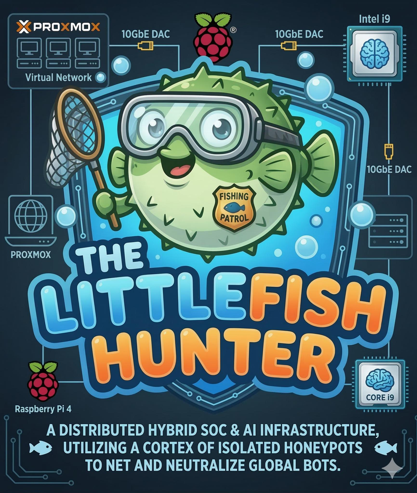
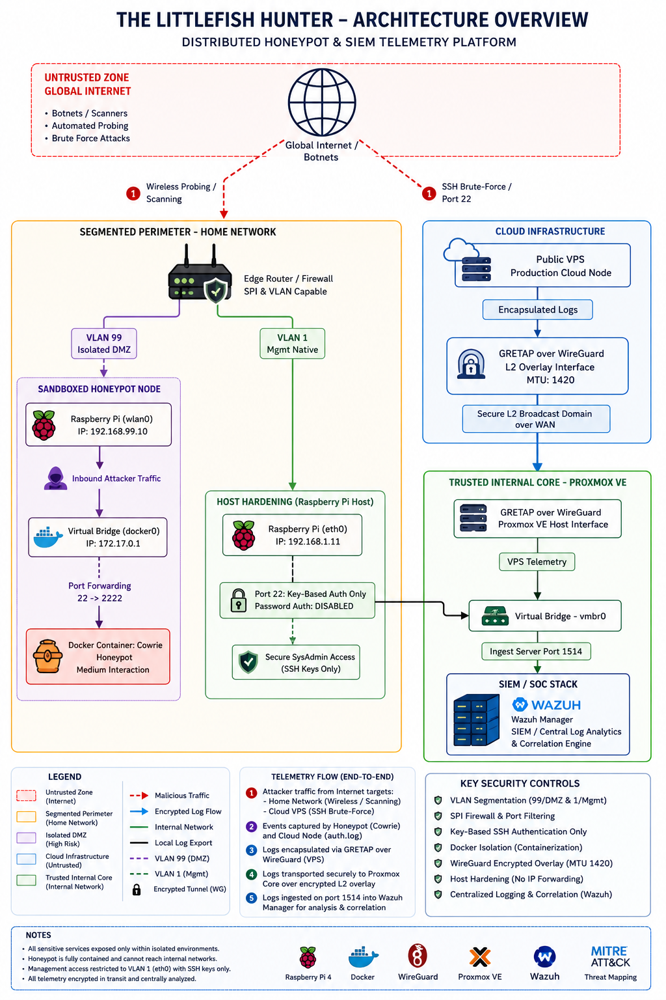

<p align="center">
  
</p>

<br>
<br>

# The Littlefish Hunter – AI-Powered Honeypot & Threat Detection Node

An automated Cyber Threat Intelligence (CTI) and forensic analysis platform deployed within a residential hybrid infrastructure (**rpilab**). This project demonstrates initial access interception, cross-infrastructure network telemetry correlation, and active post-exploitation attribution of global automated threat campaigns.

<br>
<br>
<br>

## 🛠️ Infrastructure Architecture & Flow

<p align="center">
  
</p>

<br>
<br>
<br>

---

<br>

## 🚀 Project Phases & Evolution

<br>

### 📄 Phase 1: Core SOC Infrastructure Deployment
* **Description:** Engineering the cross-platform SIEM/XDR environment. Covers local virtualization routing stability (Proxmox VE), WireGuard L3 forwarding over NAT via advanced `iptables` rules, and deep Sysmon ingest configuration for Windows Server 2025 endpoints.
<br>

* 👉 [Download SOC Infrastructure Phase 1 Report (PDF)](./reports/full/SOC_wazuh_phase1.pdf)

<br>
<br>

### 📄 Phase 2: Active Defense & SIEM Integration
* **Description:** Technical documentation focusing on host hardening, hardware-level VLAN 99 network segmentation using Alta Labs infrastructure, and configuring local dockerized sandboxes. Includes full documentation of offline manual penetration simulation (using a local Ubuntu attacking node) and validation of the container pipeline to verify live alerts generation in the Wazuh dashboard prior to public exposure.
<br>

* 👉 [Download Honeypot Sensor Lab Phase 2 Report (PDF)](./reports/full/The_Little_Fish_Hunter.pdf)

<br>
<br>

### 📄 Phase 2 Extension: Honeypot Simulation & Detection Validation
* **Description:** Advanced attack scenario validation log capturing full multi-stage adversary tactics. Documents structural alert responses for non-intrusive service scans (`nmap -sV -Pn`), high-frequency automated password cracking suites (`hydra`), and tracks post-compromise terminal command injection chains.
<br>

* 👉 [Download Honeypot Validation Blueprint (PDF)](<./reports/full/The Little Fish Hunter – Attack Simulation & Detection Validation (Phase 2).pdf>)

<br>
<br>

### 📄 Phase 3: Hybrid Infrastructure De-anonymization Report
* **Description:** Advanced engineering blueprint detailing the technical elimination of proxy-induced identity masking. Maps out the setup of native edge-level logging rule chains (`SOC_ACCESS`), Wazuh data log parsers, custom XML correlation parameters, and live GeoIP analysis.
<br>

* 👉 [Download De-anonymization Architecture Report (PDF)](./reports/full/De-anonymizing_Attacks.pdf)

<br>
<br>

### 📄 Phase 4: Comprehensive Threat Intelligence (Final Report)
* **Description:** The final core research paper cross-referencing multi-node global telemetry to isolate coordinated botnet campaigns. Profiles real-world adversary behavior, analyzes credential-stuffing distributions, and establishes definitive attribution metrics.
<br>

* 👉 [Download Threat Intelligence Phase 3 Report (PDF)](./reports/full/TheLittleFishHunter_Phase3_FINAL_RAPORT.pdf)

<br>
<br>

### 📄 Incident Analysis Study: Distributed Attack Infrastructure
* **Description:** A macro-level investigation focused on the wide-scale triangulation of automated global campaigns, profiling carrier netblocks, geographic attacker distribution, and multi-vector credential stuffing blasts.
<br>

* 👉 [Download Campaign Intelligence Report (PDF)](./reports/full/SOC_Threat_Intelligence_Report_Botnet_Campaign.pdf)

<br>
<br>

### 📄 Forensic Deep Dive: Threat Host Attribution
* **Description:** A micro-level forensic examination isolating a single high-frequency attacking node. Outlines the active technical CLI workflow executed on the host system to extract IoC artifacts from a **56.9 MB** raw `cowrie.json` telemetric stream.
<br>

* 👉 [Download Deep-Dive Forensic Report (PDF)](./reports/full/CTI_Threat_Report_Kinsing_Botnet.pdf)

<br>
<br>

### 📄 Phase 4 Extension: Automated Malware Triage & VirusTotal API Integration

**Description:** Engineering documentation covering the implementation of a fully automated malware enrichment pipeline. Integrates Cowrie's persistent Docker volume mounts with Wazuh FIM (inotify, real-time SHA-256 hashing) and the VirusTotal REST API — eliminating manual triage overhead for dropped payloads. Validated end-to-end using an EICAR test signature, triggering Rule 87105 and returning a 60-engine malicious verdict within seconds of filesystem write detection.

👉 [Download Automated Threat Detection Pipeline Report (PDF)](./reports/full/Automated_Threat_Detection_Pipeline.pdf)

<br>
<br>
#### 🚨 Incident Response & Live Detection Logs

* 👉 [INC-2026-001: Automated Malware Triage Pipeline Validation (PDF)](./reports/incident/INC-2026-001_Incident_Report.pdf) — Technical verification of the automated containment pot, triggering real-time SHA-256 integrity alerts via simulated EICAR patch writes.
* 👉 [INC-2026-002: Unauthorized SSH Access & Post-Compromise Reconnaissance (PDF)](./reports/incident/INC-2026-002_Incident_Report.pdf) — Live triage of an active brute-force intrusion, tracking rapid post-exploitation environment fingerprinting within seconds of breach validation.
* 👉 [INC-2026-003: Active Payload Deployment & Session Termination (PDF)](./reports/incident/INC-2026-003_Incident_Report.pdf) — In-depth analysis of a multi-stage malware execution loop tracking dropper ingestion attempts and subsequent sandbox isolation.
* 👉 [INC-2026-004: SIEM Logging Discrepancy & Rules Engineering (PDF)](./reports/incident/INC-2026-004_Incident_Report.pdf) — *[Pending Upload]* Analysis of unparsed system telemetry variables leading to custom XML decoder modifications and rule enhancement.
* 👉 [INC-2026-005: Automated Multi-Wave Campaign & Rule Verification (PDF)](./reports/incident/INC-2026-005_Incident_Report.pdf) — *[Pending Upload]* High-density reconnaissance campaign analysis validating the operational success of the updated detection framework.
<br>
<br>


---

<br>

## 📋 Project Overview & CTI Metrics

<br>

* 🛡️ **SIEM Platform:** Wazuh Manager (Debian) hosting a heterogeneous fleet of 9 active endpoints across 5 operating systems.
<br>

* 🪵 **Telemetry Source:** Cowrie Honeypot (Hardened Docker Image, port mapping 22 -> 2222) + Public VPS Auth Engine[cite: 687].
  
<br>

* 🌐 **Attack Surface Volume:** Captured **937 unique attacking IP addresses** on the residential honeypot and **30,576 authentication failures** on the public cloud node within a single 24-hour window.

<br>

* 🎯 **Cross-Infra Correlation:** Confirmed an active, coordinated botnet campaign utilizing 4 sequential IPs from a single /29 routed block (**87.251.64.144–149**) attacking both independent environments concurrently (1,244 total correlated hits).

<br>

* 🏴‍☠️ **Adversary Attribution:** Threat actor group utilizing Polish ASN space (WHOIS: Isaev Igor Maratovich) operating rented VPS scanning nodes alongside active IoT worms targeting default hardware firmware credentials (`345gs5662d34`).

<br>
<br>
<br>

---

<br>

## 🔬 Project Documentation & Technical Reports

This laboratory setup generated high-fidelity telemetry that was analyzed and documented across successive execution phases. You can access the complete technical PDF reports directly within this repository:

<br>

### 📄 Phase 1: Core SOC Infrastructure Deployment
* **Description:** Engineering the cross-platform SIEM/XDR environment. Covers local virtualization routing stability (Proxmox VE), WireGuard L3 forwarding over NAT via advanced `iptables` rules, and deep Sysmon ingest configuration for Windows Server 2025 endpoints.
<br>

* 👉 [Download SOC Infrastructure Phase 1 Report (PDF)](./SOC_wazuh_phase1.pdf)

<br>
<br>

### 📄 Phase 2: Active Defense & SIEM Integration
* [cite_start]**Description:** Technical documentation focusing on host hardening, hardware-level VLAN 99 network segmentation using Alta Labs infrastructure, and configuring local dockerized sandboxes[cite: 656, 657]. [cite_start]Includes full documentation of offline manual penetration simulation (using a local Ubuntu attacking node) and validation of the container pipeline to verify live alerts generation in the Wazuh dashboard prior to public exposure[cite: 658, 659, 663, 694, 695].
<br>

* 👉 [Download Honeypot Sensor Lab Phase 2 Report (PDF)](./The_Little_Fish_Hunter.pdf)

<br>
<br>

### 📄 Phase 2 Extension: Honeypot Simulation & Detection Validation
* [cite_start]**Description:** Advanced attack scenario validation log capturing full multi-stage adversary tactics[cite: 644]. [cite_start]Documents structural alert responses for non-intrusive service scans (`nmap -sV -Pn`), high-frequency automated password cracking suites (`hydra`), and tracks post-compromise terminal command injection chains[cite: 660, 667, 689, 691, 724, 725, 751].
<br>

* 👉 [Download Honeypot Validation Blueprint (PDF)](<./The Little Fish Hunter – Attack Simulation & Detection Validation (Phase 2).pdf>)

<br>
<br>

### 📄 Phase 3: Hybrid Infrastructure De-anonymization Report
* [cite_start]**Description:** Advanced engineering blueprint detailing the technical elimination of proxy-induced identity masking[cite: 564, 569]. [cite_start]Maps out the setup of native edge-level logging rule chains (`SOC_ACCESS`), Wazuh data log parsers, custom XML correlation parameters, and live GeoIP analysis[cite: 568, 585, 587, 588, 604, 621, 628, 632].
<br>

* 👉 [Download De-anonymization Architecture Report (PDF)](./De-anonymizing_Attacks.pdf)

<br>
<br>

### 📄 Phase 4: Comprehensive Threat Intelligence (Final Report)
* **Description:** The final core research paper cross-referencing multi-node global telemetry to isolate coordinated botnet campaigns. Profiles real-world adversary behavior, analyzes credential-stuffing distributions, and establishes definitive attribution metrics.
<br>

* 👉 [Download Threat Intelligence Phase 3 Report (PDF)](./TheLittleFishHunter_Phase3_FINAL_RAPORT.pdf)

<br>
<br>

### 📄 Incident Analysis Study: Distributed Attack Infrastructure
* **Description:** A macro-level investigation focused on the wide-scale triangulation of automated global campaigns, profiling carrier netblocks, geographic attacker distribution, and multi-vector credential stuffing blasts.
<br>

* 👉 [Download Campaign Intelligence Report (PDF)](./SOC_Threat_Intelligence_Report_Botnet_Campaign.pdf)

<br>
<br>

### 📄 Forensic Deep Dive: Threat Host Attribution
* **Description:** A micro-level forensic examination isolating a single high-frequency attacking node. Outlines the active technical CLI workflow executed on the host system to extract IoC artifacts from a **56.9 MB** raw `cowrie.json` telemetric stream.
<br>

* 👉 [Download Deep-Dive Forensic Report (PDF)](./CTI_Threat_Report_Kinsing_Botnet.pdf)

<br>
<br>

### 📄 Phase 4 Extension: Automated Malware Triage & VirusTotal API Integration

**Description:** Engineering documentation covering the implementation of a fully automated malware enrichment pipeline. Integrates Cowrie's persistent Docker volume mounts with Wazuh FIM (inotify, real-time SHA-256 hashing) and the VirusTotal REST API — eliminating manual triage overhead for dropped payloads. Validated end-to-end using an EICAR test signature, triggering Rule 87105 and returning a 60-engine malicious verdict within seconds of filesystem write detection.

👉 [Download Automated Threat Detection Pipeline Report (PDF)](./Automated_Threat_Detection_Pipeline.pdf)

<br>
<br>

### 📄 Incident Response: INC-2026-001 — Automated Malware Triage (Pipeline Validation)
* **Description:** Formal IR ticket documenting the end-to-end validation of the automated threat detection pipeline. Records the complete detection lifecycle: EICAR payload drop → Wazuh FIM (inotify) trigger → SHA-256 hash computation → VirusTotal REST API enrichment → Rule 87105 alert (severity 12). Confirms sub-5-second alert-to-enrichment latency. MITRE: T1203.
<br>

* 👉 [Download IR Ticket INC-2026-001 (PDF)](./INC-2026-001_Incident_Report.pdf)

---

### 📄 Incident Response: INC-2026-002 — Unauthorized SSH Access & Post-Compromise Reconnaissance
* **Description:** Formal IR ticket documenting a real-world multi-stage intrusion captured by the Cowrie honeypot. Covers the full attack chain: automated SSH brute-force → successful root login → immediate `uname -a` system fingerprinting. Full IoC table, GeoIP enrichment (Salvador, Brazil), and MITRE chain T1110 → T1078 → T1059 → T1082 → T1105. Attack-to-recon time: ~6 seconds.
<br>

* 👉 [Download IR Ticket INC-2026-002 (PDF)](./INC-2026-002_Incident_Report.pdf)

<br>
<br>

### 📄 Incident Response: INC-2026-003 — Linux Cryptominer Payload Delivery via SFTP
* **Description:** Formal IR ticket documenting a real-world malware delivery event captured live by the Cowrie honeypot. A threat actor (49.173.65.19, Seoul, South Korea) uploaded a 23.44 MB ELF64 Linux cryptominer binary via SFTP, deliberately naming it `sshd` to masquerade as the legitimate OpenSSH daemon — a deliberate defence evasion technique. Wazuh FIM detected the upload (Rule 100203) and the automated VirusTotal pipeline returned a 37/65 engine malicious verdict within **2 seconds**. Full payload analysis included: SHA-256, MD5, AV vendor verdicts (Kaspersky, ESET, Microsoft, ClamAV), MITRE chain T1105 → T1036 → T1059 → T1496 → T1203.
<br>

* 👉 [Download IR Ticket INC-2026-003 (PDF)](./INC-2026-003_Incident_Report.pdf)

---
<br>
<br>

## 💻 Forensic Log Extraction Playbook (Summary)

To bypass image bin constraints within the active container, the following forensic execution layout was utilized to isolate 29 unique malicious SSH public keys:

<br>

```bash
# 1. Audit container state
docker ps

# 2. Extract active telemetry database out of the container
docker cp cowrie:/home/cowrie/cowrie/log/cowrie.json ./cowrie_local.json

# 3. Parse and de-duplicate raw ssh-rsa strings using regex
grep -o "ssh-rsa [A-Za-z0-9+/]*=\?" cowrie_local.json | sort -u > botnet_key.txt

# 4. Generate deterministic cryptographic hash of the evidence
sha256sum botnet_key.txt
```
Disclaimer: This repository is part of a secure home-laboratory project used exclusively for active defense research, log analysis, threat telemetry collection, and advanced multi-node event correlation. All offensive simulations and brute-force drills were executed inside a strictly contained, sandboxed VLAN layer with isolated network boundaries active
